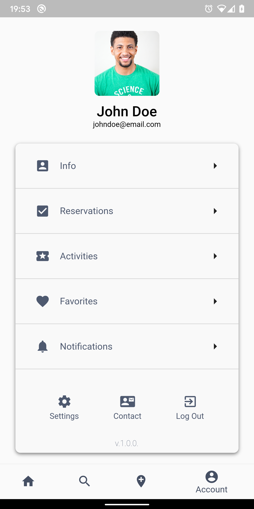

# Foodly - Flutter UI Project
[](https://codemagic.io/apps/5d9e1a6921a400126a04c659/5d9e1a6921a400126a04c658/latest_build)  [](https://opensource.org/licenses/Apache-2.0)  [](https://opensource.org/licenses/MIT)

Foodly is my project in Flutter to see what can I do with the Flutter framework in UI designing. This is made with the help of the Sketch, and all code is written in Dart. All widgets are separated to keep clean code, and you can find all the code in the [/lib] folder.

I hope that this project will help someone with learning or searching for some new widgets for your project.
This project will be updated for long, as I will have time for it.

If I helped you in any way, or love this project, you can always support me.

[](https://github.com/avalentic/foodly) [](https://github.com/avalentic/foodly/fork) [](https://github.com/avalentic/foodly) [](https://github.com/avalentic/foodly)
[](https://twitter.com/avalentic2)

# Screenshots
  
  
  

# Project created and maintained by
### Antonio Valentic
##### Passionate Flutter developer

<a href="https://play.google.com/store/apps/dev?id=5098608087857992213"></a>
<a href="https://linkedin.com/in/avalentic"></a>
<a href="https://twitter.com/avalentic2"></a>
<a href="https://facebook.com/avalentic3"></a>

# Donate

> If you found this project helpful or you learned something from the source code and want to thank me, consider buying me a cup of :coffee:
>
> - [PayPal](https://www.paypal.me/avalentic/)

# License
```
MIT License

Copyright (c) 2019 Antonio Valentic

Permission is hereby granted, free of charge, to any person obtaining a copy
of this software and associated documentation files (the "Software"), to deal
in the Software without restriction, including without limitation the rights
to use, copy, modify, merge, publish, distribute, sublicense, and/or sell
copies of the Software, and to permit persons to whom the Software is
furnished to do so, subject to the following conditions:

The above copyright notice and this permission notice shall be included in all
copies or substantial portions of the Software.

THE SOFTWARE IS PROVIDED "AS IS", WITHOUT WARRANTY OF ANY KIND, EXPRESS OR
IMPLIED, INCLUDING BUT NOT LIMITED TO THE WARRANTIES OF MERCHANTABILITY,
FITNESS FOR A PARTICULAR PURPOSE AND NONINFRINGEMENT. IN NO EVENT SHALL THE
AUTHORS OR COPYRIGHT HOLDERS BE LIABLE FOR ANY CLAIM, DAMAGES OR OTHER
LIABILITY, WHETHER IN AN ACTION OF CONTRACT, TORT OR OTHERWISE, ARISING FROM,
OUT OF OR IN CONNECTION WITH THE SOFTWARE OR THE USE OR OTHER DEALINGS IN THE
SOFTWARE.
```

[/lib]: <https://github.com/avalentic/foodly/tree/master/lib>
